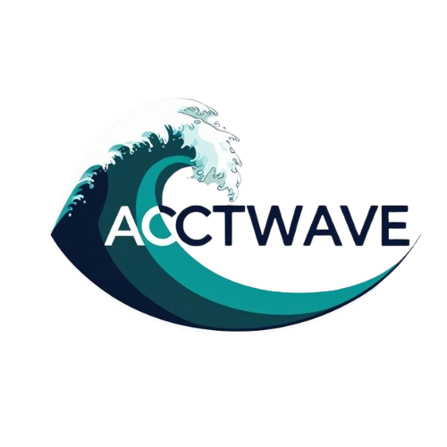

# Acctwave 🌊

**The #1 Nigerian Platform for Social Media Growth & Virtual Numbers**

Acctwave is a high-end, fullstack web application designed to provide instant social media boosting services and temporary virtual numbers for SMS verification. Built with a focus on premium aesthetics, speed, and user experience.



## 🚀 Features

-   **Social Media Growth**: Instant delivery of followers, likes, views, and comments for Instagram, TikTok, X (Twitter), and more.
-   **Virtual Numbers**: Generate temporary phone numbers (USA, UK, etc.) for SMS verification on any platform.
-   **Premium UI/UX**: A stunning "Deep Electric Blue" dark mode design featuring glassmorphism and smooth animations.
-   **Real-time Processing**: Instant order calculation and status updates.
-   **Responsive Design**: Fully optimized for mobile and desktop devices.

## 🛠️ Tech Stack

-   **Framework**: [Next.js 14](https://nextjs.org/) (App Router)
-   **Language**: [TypeScript](https://www.typescriptlang.org/)
-   **Styling**: [Tailwind CSS](https://tailwindcss.com/)
-   **Animations**: [Framer Motion](https://www.framer.com/motion/)
-   **Icons**: [Lucide React](https://lucide.dev/)

## 🏃‍♂️ Getting Started

1.  **Clone the repository**
    ```bash
    git clone https://github.com/99Softpeace/acctwave.git
    cd acctwave
    ```

2.  **Install dependencies**
    ```bash
    npm install
    ```

3.  **Run the development server**
    ```bash
    npm run dev
    ```

4.  Open [http://localhost:3000](http://localhost:3000) with your browser to see the result.

## 📄 License

This project is proprietary and confidential.

---
*Built with ❤️ for the Nigerian Digital Community.*
